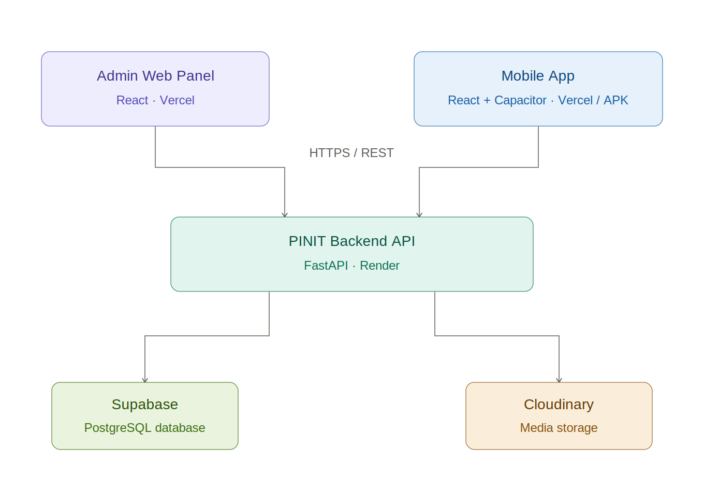

<div align="center">


# PINIT — Backend API

[](https://fastapi.tiangolo.com)
[](https://python.org)
[](https://supabase.com)
[](https://pinit-backend.onrender.com)

**[Live API](https://pinit-backend.onrender.com)** | **[API Docs](https://pinit-backend.onrender.com/docs)** | **[Admin Panel](https://image-crypto-analyzer.vercel.app)** | **[Mobile App](https://pinit-mobile.vercel.app)**

</div>

---

PINIT is an **image forensics and ownership verification platform**. It embeds a unique UUID invisibly into every pixel of an image at the point of capture — creating a tamper-evident cryptographic fingerprint that proves both **authenticity and ownership**.

This repository is the **shared backend API** powering both the PINIT Admin Panel and the PINIT Mobile App.

---

## 📰 News

- 🚩 **[2026.04]** PINIT presented to enterprise clients — Admin Panel, Mobile App, and Backend fully operational.
- 🚩 **[2026.03]** User mobile app extracted into a dedicated repository. Platform now follows a clean 3-repo architecture.
- 🚩 **[2026.02]** Backend API deployed on Render. Supabase and Cloudinary integrations live.
- 🚩 **[2026.01]** Initial combined platform launched — Admin Panel and Mobile App sharing a single backend.

---

## 📜 Introduction

PINIT addresses a critical problem in digital media — **proving that an image is authentic and unmodified**. Traditional metadata can be stripped or forged. PINIT solves this through cryptographic pixel-level embedding.

The platform works in two stages:

1. At the point of capture, a **unique UUID is embedded invisibly into the image pixels**, binding the image to the user's identity. This creates a certified asset stored in the vault with a complete metadata record.

2. When authenticity is challenged, a suspect image is submitted for **forensic comparison** against the certified original. The backend runs a multi-signal analysis pipeline — perceptual hashing, histogram analysis, and pixel-level diffing — returning a 5-tier verdict with a calibrated confidence score.

---

## 🏗️ Architecture



| Client | Type | Description |
|---|---|---|
| Admin Panel | React Web App | Platform management — users, assets, reports, audit logs |
| Mobile App | React + Capacitor (Android APK) | End-user image certification and forensic comparison |

---

## 🗂️ Project Structure

```
pinit-backend/
│
├── main.py                  # 🚀 FastAPI entry point (init, CORS, router registration)
├── requirements.txt         # 📦 Dependencies
├── runtime.txt              # 🐍 Python version (Render deployment)
├── .env.example             # 🔐 Environment config template
│
├── routers/                 # 🌐 API layer (core business logic)
│   ├── auth.py              # 🔑 Auth (OTP, JWT, WebAuthn)
│   ├── vault.py             # 🗄️ Image storage & vault management
│   ├── compare.py           # 🔬 Forensic analysis & tamper detection
│   ├── certificates.py      # 📜 Certificate generation & verification
│   ├── share_links.py       # 🔗 Secure share link system
│   └── admin.py             # 🛡️ Admin operations (role-protected)
│
├── models/                  # 📐 Data layer
│   └── schemas.py           # 📋 Pydantic request/response models
│
├── db/                      # 🗃️ Database integration
│   └── database.py          # 🔌 Supabase client setup
│
├── utils/                   # 🔧 Shared utilities
│   ├── auth_helpers.py      # 🔒 JWT handling, role checks, audit logs
│   ├── cloudinary_helper.py # ☁️ Image upload/retrieval (Cloudinary)
│   └── email_helper.py      # 📧 OTP email service
│
└── tests/                   # 🧪 Testing layer
    ├── test_cloudinary.py
    └── test_connection.py
```

---

## 📡 API Reference

| Router | Prefix | Description |
|---|---|---|
| Auth | `/auth` | Registration, OTP, login, JWT tokens, WebAuthn passkeys |
| Vault | `/vault` | Store and retrieve certified image assets |
| Compare | `/compare` | Forensic comparison — pHash · histogram · pixel diff |
| Certificates | `/certificates` | Generate and verify authenticity certificates |
| Share Links | `/api/share-links` | Create public share tokens for vault assets |
| Admin | `/admin` | User management, audit log, platform stats *(admin only)* |

### Forensic verdict tiers

| Verdict | Description |
|---|---|
| `EXACT MATCH` | Image is unmodified — pixel-perfect match |
| `STRONG MATCH` | Minor compression artefacts only — no tampering |
| `PARTIAL MATCH` | Detectable changes — possible cropping or minor edits |
| `WEAK SIMILARITY` | Significant differences — likely tampered |
| `NO MATCH` | Images are unrelated or heavily altered |

---

## 🚀 Getting Started

### Prerequisites

- Python 3.11+
- A [Supabase](https://supabase.com) project
- A [Cloudinary](https://cloudinary.com) account

### Installation

1. Clone the repository

```sh
git clone https://github.com/mannevi/pinit-backend.git
cd pinit-backend
```

2. Create and activate a virtual environment

```sh
python -m venv venv
source venv/bin/activate
# Windows: venv\Scripts\activate
```

3. Install dependencies

```sh
pip install -r requirements.txt
```

4. Configure environment variables

```sh
cp .env.example .env
# Open .env and fill in your credentials
```

5. Start the development server

```sh
uvicorn main:app --reload
```

The API runs at `http://localhost:8000`  
Interactive docs at `http://localhost:8000/docs`

---

## ⚙️ Environment Variables

| Variable | Description |
|---|---|
| `SUPABASE_URL` | Supabase project URL |
| `SUPABASE_KEY` | Supabase anon (publishable) key |
| `SUPABASE_SERVICE_KEY` | Supabase service role key |
| `JWT_SECRET` | Secret key for signing access tokens |
| `JWT_EXPIRE_MINUTES` | Token expiry window in minutes |
| `CLOUDINARY_CLOUD_NAME` | Cloudinary cloud identifier |
| `CLOUDINARY_API_KEY` | Cloudinary API key |
| `CLOUDINARY_API_SECRET` | Cloudinary API secret |
| `APP_URL` | Frontend base URL — used in CORS |
| `RP_ID` | WebAuthn relying party domain |
| `RP_NAME` | WebAuthn relying party display name |

> **Note:** Never commit `.env` to version control. In production, all variables are configured directly in the Render dashboard.

---

## 🔗 Related Repositories

| Repository | Description | URL |
|---|---|---|
| [pinit-admin](https://github.com/mannevi/image-crypto-analyzer) | Admin Web Panel (React) | https://image-crypto-analyzer.vercel.app |
| [pinit-mobile](https://github.com/mannevi/pinit-mobile) | User Mobile App (React + Capacitor / Android APK) | https://pinit-mobile.vercel.app |

---

© 2026 PINIT. All rights reserved.
